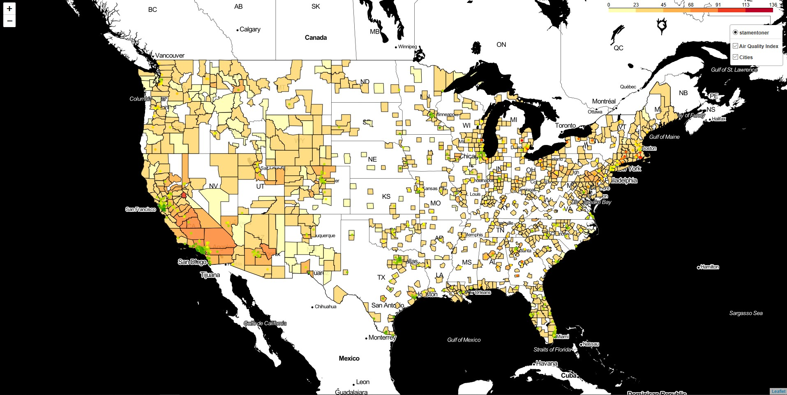
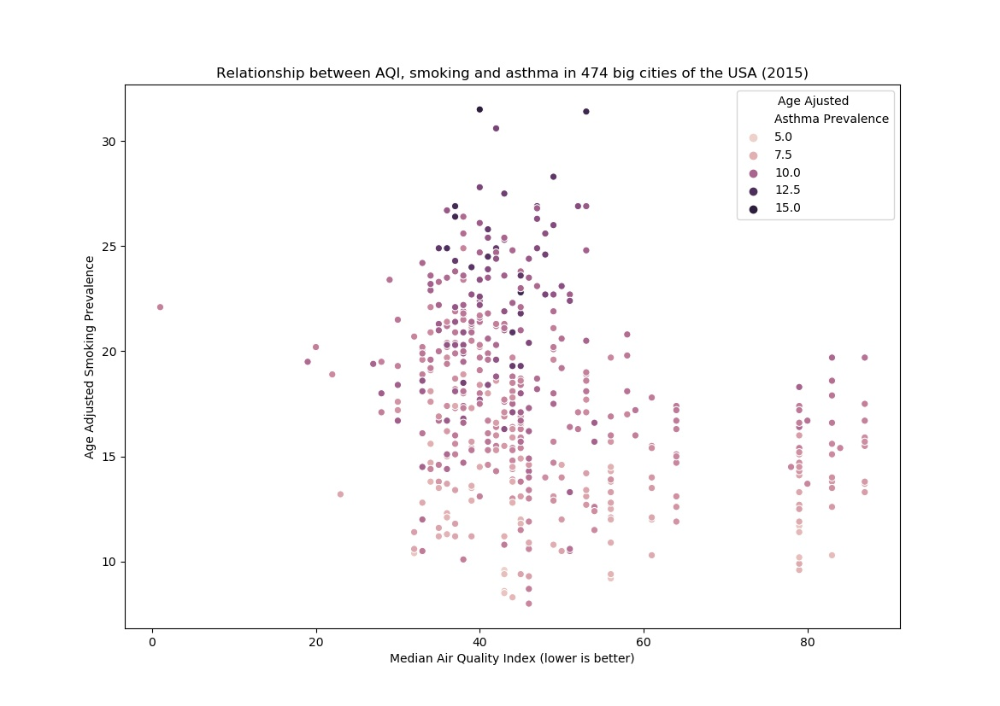

# Asthma and Air Quality 

This project looked at the link between the prevalence of asthma in 500 American cities and the Air Quality Index of the county those cities are in.

# To replicate the findings

If you wish to replicate the map and figure, you will need to download files. The links are also in the Main.py file:
* [Health data from the 500 cities project](https://chronicdata.cdc.gov/500-Cities/500-Cities-Local-Data-for-Better-Health-2018-relea/6vp6-wxuq)
* [Air quality data for many US counties](https://aqs.epa.gov/aqsweb/airdata/annual_aqi_by_county_2015.zip)
* [List of cities and the info on their county](https://simplemaps.com/data/us-cities)
* [Shapefile of the counties](http://www2.census.gov/geo/tiger/GENZ2015/shp/cb_2015_us_county_5m.zip). 

The shapefile needs to be uploaded to [Mapshaper](www.mapshaper.org) and then saved as a GEOjson.
Take these four files and put them in a subdirectory named /data 
You can now use the script, which should generate a jpg file for the figure and a html file for the map

# Results
On this map, we see the Median Air Quality Index of about 1000 USA counties, from best (in light yellow) to worst (in dark red).
Each green, yellow and red dots represent one of 476 cities found in the 500 cities database. The cities with the lowest prevalence are in green, and those with the highest, in red.

This plot shows how the air quality (horizontal axis) and smoking prevalence (vertical axis) are linked with asthma prevalence. It seems that air quality is almost uncorrelated to asthma prevalence, whereas smoking is clearly linearly correlated.

